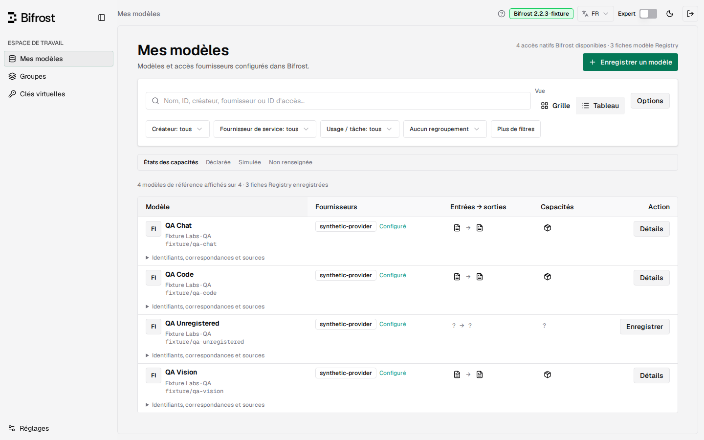
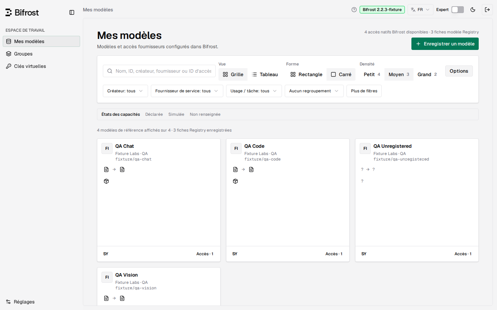
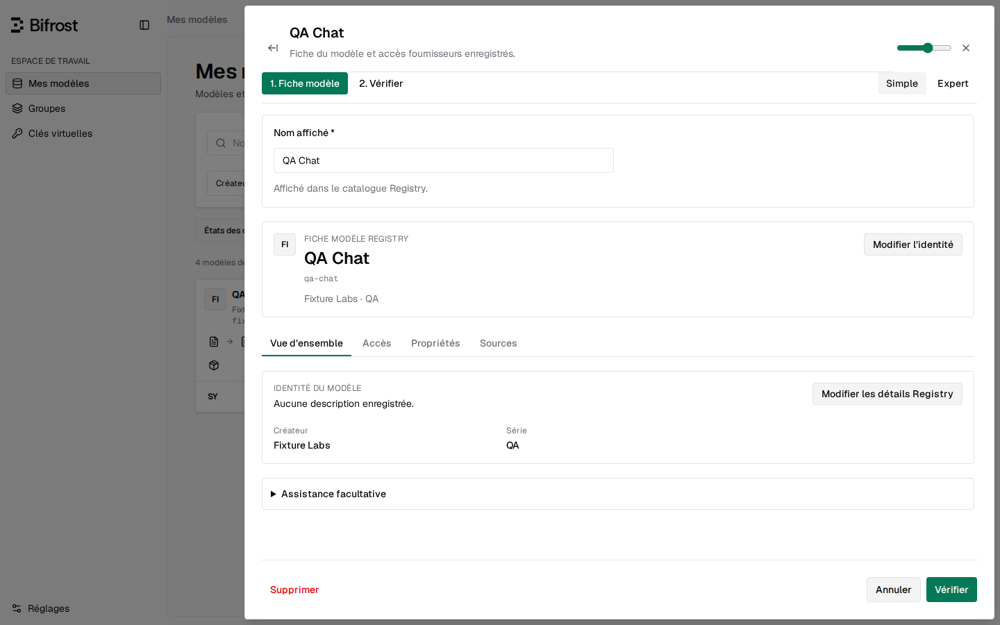
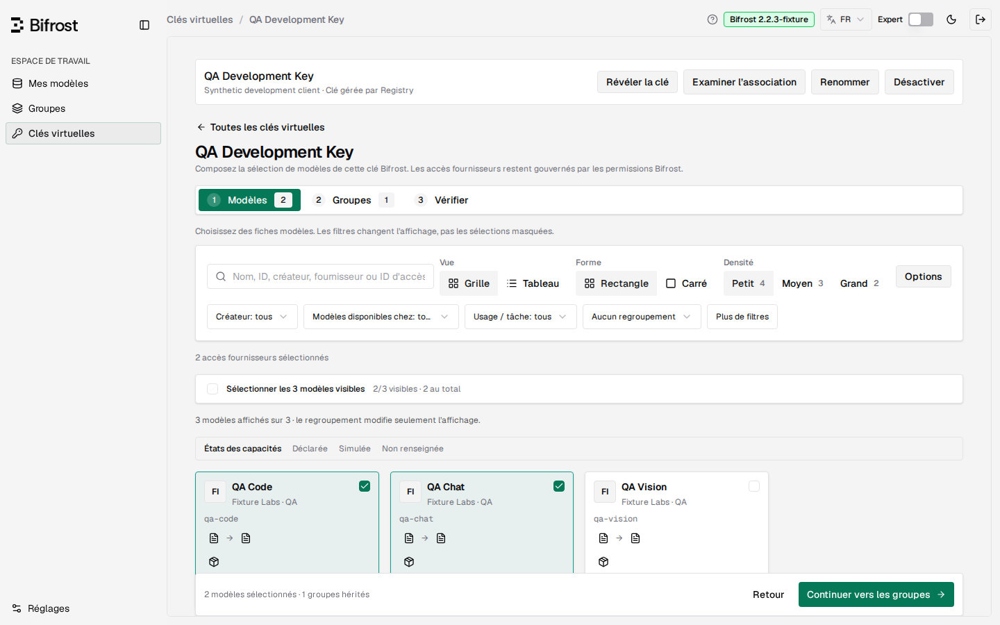
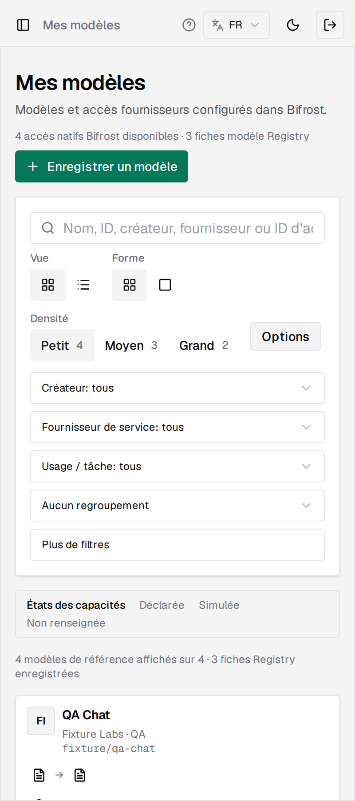

<div align="center">


# Bifrost Registry

**Un catalogue de modèles fiable et une composition d'accès par clé pour les clés virtuelles Bifrost.**

Organisez chaque modèle une seule fois, puis décidez exactement de ce que chaque clé virtuelle peut atteindre — via une interface embarquée qui tourne à côté de votre gateway Bifrost existant.

[](https://github.com/sofianbll/bifrost-plugin-registry/actions/workflows/ci.yml)
[](https://github.com/sofianbll/bifrost-plugin-registry/releases/tag/v0.3.0-rc.5)
[](LICENSE)

[English](README.md) · Français

</div>


*Un catalogue consultable des références Models.dev et Bifrost, avec provenance par champ et corrections révisables.*

L'interface est **anglaise par défaut** ; le français est disponible en un clic (sélecteur de langue) ou via `?lang=fr`.

## Ce que fait Registry

- **Catalogue Models.dev embarqué** — un instantané de référence versionné et reproductible, avec provenance par champ, liens canoniques et corrections manuelles qui survivent aux rafraîchissements.
- **Endpoints par accès** — chaque accès fournisseur choisit ses opérations exposées indépendamment (Chat Completions et Responses sont des choix distincts).
- **Sélection d'accès par clé** — choisissez ce que chaque clé virtuelle peut atteindre ; exclusions et ajouts sont révisés avant publication.
- **Corrections de prix natives** — corrections tarifaires et accès restreint par clé appliqués via la gouvernance Bifrost elle-même, pas une couche parallèle. Les limites techniques ne sont pas appliquées nativement.
- **Routage natif restreint** — publiez des alias partagés qui ne routent que parmi les accès retenus par chaque clé.
- **UI embarquée + import/export** — panneau React sur son propre port, instantanés JSON versionnés avec aperçu et sauvegarde, export CSV aplati.

## Démarrage rapide

```bash
# 1. Récupérez l'image dynamique Bifrost 2.2.4 publiée (Linux AMD64 ou ARM64, sans plugin)
docker pull ghcr.io/sofianbll/bifrost-dynamic:2.2.4
# 2. Fournissez les deux identifiants admin et un volume persistant sur /app/data
export REGISTRY_ADMIN_TOKEN=…  REGISTRY_BIFROST_AUTH='Basic …'
# 3. Ajoutez le .so correspondant par URL directe dans les réglages plugin de Bifrost
#    https://github.com/sofianbll/bifrost-plugin-registry/releases/download/v0.3.0-rc.5/bifrost-registry-v0.3.0-rc.5-linux-<amd64|arm64>.so
# 4. Ouvrez le panneau
open http://127.0.0.1:8099/model-registry
```

**[Installation, configuration et retour arrière complets →](docs/fr/INSTALL.md)** — deux modes : l'image dynamique publiée plus l'URL du plugin, ou le plugin seul sur tout Bifrost compilé avec chargement dynamique. Si l'ajout du plugin échoue avec une erreur de permission sur un fichier temporaire, voir [Dépannage](docs/fr/TROUBLESHOOTING.md).

## Captures d'écran

| | |
| --- | --- |
| <br>**Grille** — cartes à hauteur égale avec provenance par champ | <br>**Tableau** — comparaison dense par créateur et famille |
| <br>**Options d'affichage** — formes et densités grille/carré/tableau | <br>**Fiche modèle** — un modèle, des accès fournisseurs distincts |
| <br>**Compositeur de clé** — politiques d'accès basic et expert | <br>**Mobile** — les mêmes parcours à 400 px |

## Pourquoi

Bifrost gouverne l'inférence, les identifiants, les budgets et le routage. Ce qu'il ne donne pas à l'opérateur, c'est une image fiable et révisable de ce que chaque clé virtuelle peut réellement atteindre. Registry comble ce trou : un catalogue des références Models.dev et Bifrost, avec provenance par champ et corrections manuelles qui survivent aux rafraîchissements, composé en politiques d'accès pour les clés virtuelles.

L'embarquement d'un instantané Models.dev versionné rend le catalogue reproductible et hors-ligne — aucune dépendance d'exécution vers une API tierce. L'image du gateway est un Bifrost 2.2.4 non modifié compilé avec chargement dynamique, et Registry reste un plugin installé séparément : le chemin d'inférence auquel vous faites confiance n'est jamais patché.

Projet indépendant, pas un produit officiel Maxim/Bifrost.

## Pour aller plus loin

- [Installation](docs/fr/INSTALL.md) — fichiers de release, identifiants, stockage persistant, mise à jour et retour arrière.
- [Configuration](docs/fr/CONFIGURATION.md) — fiches Registry, groupes, politiques de clé et anciennes datasheets.
- [Guide utilisateur](docs/fr/USER-GUIDE.md) — enregistrement de modèles, sources, groupes et composition de clés.
- [Dépannage](docs/fr/TROUBLESHOOTING.md) — permissions du répertoire temporaire, `Dynamic loading not supported`, échecs d'activation.
- [Compilation native](docs/BUILD.md) — compiler le gateway et le `.so` avec des dépendances compatibles.
- [Index de la documentation](docs/fr/README.md) · [Changelog](CHANGELOG.md) · [État](STATUS.md).

## Exécution et qualification

La release courante **v0.3.0-rc.5** (pré-release) est le Registry de v0.3.0-rc.4 recompilé et testé contre Bifrost 2.2.4 non modifié (`transports/v2.2.4`, commit `ed8371a`) pour Linux AMD64 et ARM64 (musl), Go 1.27.1. La qualification native a tourné sur les deux architectures avec des fournisseurs synthétiques ([exécution de release](https://github.com/sofianbll/bifrost-plugin-registry/actions/runs/37011831292)) ; les rapports et les empreintes des `.so` sont fournis avec la release.

Les résultats ci-dessous ont été enregistrés sur la release précédente **v0.3.0-rc.4** (ARM64, Bifrost 2.2.3, commit final `d588a9f` ; interface en anglais par défaut), dont rc.5 recompile le code.

| Contrôle | Résultat |
| --- | --- |
| Gateway `bifrost-http` | `80d17483…` (build reproductible) |
| Plugin `bifrost-registry.so` | `ff21df8f…` |
| Isolation `/v1/models` par clé | 42/42 |
| Installation autonome, redémarrage, désactivation | 55/55 |
| Autonome + assistant synthétique | 72/72 |
| Adoption de clés natives | 19/19 |
| Capacités par accès (prix, VK restreinte, alias partagé) | 34/34 assertions |

[Rapport de qualification ARM64](reports/bifrost-2.2.3-arm64-869e251/README.md) · [Audit final](docs/reviews/2026-09-28-final-audit.md)

**Limites honnêtes.** Les résultats détaillés ci-dessus sont ARM64 seulement ; rc.5 ajoute la qualification AMD64 et ARM64 pour Bifrost 2.2.4. L'image officielle précompilée reste non qualifiée, et l'image téléchargée est qualifiée séparément du `.so`. Toutes les suites tournent contre des fournisseurs synthétiques, **sans inférence réelle**. La suite d'adoption de rc.4 utilise un bridge réseau limité au loopback ; les autres suites utilisent `--network none`. Aucun déploiement de production n'a été effectué, et l'intégration à la barre latérale native est différée.

## Contribuer

Ouvrez d'abord une issue avec un bug reproductible ou un cas d'usage concret, puis une pull request vers `main`. Lisez [CONTRIBUTING.md](CONTRIBUTING.md) pour les exigences et la commande `make check` complète. Les issues suivent les [cinq étiquettes de triage](docs/agents/triage-labels.md) du dépôt.

## Support

Posez vos questions et signalez les bugs via [GitHub Issues](https://github.com/sofianbll/bifrost-plugin-registry/issues). Pour les questions d'usage et de configuration, commencez par le [guide utilisateur](docs/fr/USER-GUIDE.md).

## Sécurité

Signalez les vulnérabilités en privé via [le rapport privé GitHub](https://github.com/sofianbll/bifrost-plugin-registry/security/advisories/new) ; n'ouvrez jamais d'issue publique avec des identifiants ou un exploit. Voir [SECURITY.md](SECURITY.md) pour le périmètre et les limites de confiance.

## Code de conduite

Ce projet suit le [Contributor Covenant v2.1](CODE_OF_CONDUCT.md). Signalez les comportements inacceptables via les canaux privés de [SECURITY.md](SECURITY.md).

## Licence

Le code écrit par le projet est sous [licence MIT](LICENSE). Le code et les assets UI Bifrost vendored conservent leur [licence Apache-2.0](ui/LICENSE), et les polices Geist conservent leur [SIL Open Font License](ui/public/static/fonts/OFL.txt). Voir [les notices tierces](THIRD_PARTY_NOTICES.md) et [la provenance upstream](ui/PROVENANCE.md).
