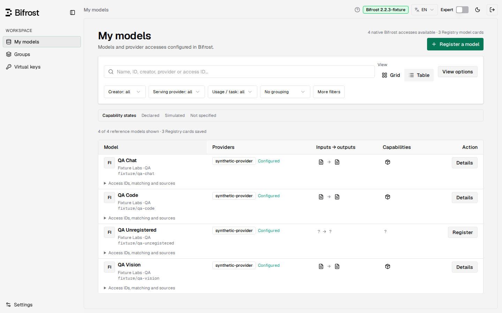
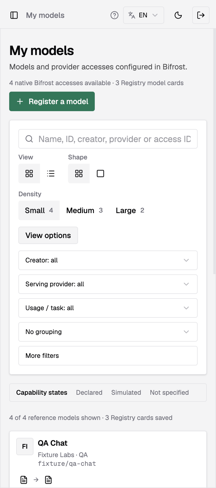

<div align="center">


# Bifrost Registry

**A trustworthy model catalog and per-key access composition for Bifrost virtual keys.**

Organize every model once, then decide exactly what each virtual key can reach — through an embedded interface that runs beside your existing Bifrost gateway.

[](https://github.com/sofianbll/bifrost-plugin-registry/actions/workflows/ci.yml)
[](https://github.com/sofianbll/bifrost-plugin-registry/releases/tag/v0.3.0-rc.6)
[](LICENSE)

English · [Français](README.fr.md)

</div>


*One searchable catalogue of Models.dev and Bifrost references, with provenance and reviewable corrections.*

## What it does

- **Embedded Models.dev catalogue** — a versioned, reproducible reference snapshot with per-field provenance, canonical links and manual corrections that survive refreshes.
- **Endpoints per access** — each provider access selects its exposed operations independently (Chat Completions and Responses are separate choices).
- **Access selection per key** — choose what each virtual key can reach; exclusions and additions are reviewed before publication.
- **Native price overrides** — apply pricing overrides and restricted per-key access through Bifrost's own governance, not a parallel layer. Technical limits are not applied natively.
- **Restricted native routing** — publish shared aliases that route only within each key's selected accesses.
- **Embedded UI plus import/export** — a React panel on its own port, versioned JSON snapshots with preview and backup, and flat CSV export.

## Quickstart

```bash
# 1. Pull the published dynamic Bifrost 2.2.5 image (Linux AMD64 or ARM64, no plugin inside)
docker pull ghcr.io/sofianbll/bifrost-dynamic:2.2.5
# 2. Provide the two admin credentials and a persistent volume at /app/data
export REGISTRY_ADMIN_TOKEN=…  REGISTRY_BIFROST_AUTH='Basic …'
# 3. Add the matching .so by direct URL in Bifrost's plugin settings
#    https://github.com/sofianbll/bifrost-plugin-registry/releases/download/v0.3.0-rc.6/bifrost-registry-v0.3.0-rc.6-linux-<amd64|arm64>.so
# 4. Open the panel
open http://127.0.0.1:8099/model-registry
```

**[Full installation, configuration and rollback →](docs/INSTALL.md)** — two modes: the published dynamic image plus the plugin URL, or the plugin alone on any Bifrost built with dynamic loading. If adding the plugin fails with a temp-file permission error, see [Troubleshooting](docs/TROUBLESHOOTING.md).

## Screenshots

| | |
| --- | --- |
| <br>**Grid** — equal-height cards with per-field provenance | <br>**Table** — dense comparison across creators and families |
| <br>**Display options** — grid, square and table densities | <br>**Model card** — one model, distinct provider accesses |
| <br>**Key composer** — basic and expert access policies | <br>**Mobile** — the same journeys at 400 px |

## The why

Bifrost governs inference, credentials, budgets and routing. What it does not give an operator is a trustworthy, reviewable picture of what each virtual key can actually reach. Registry fills that gap: one catalogue of Models.dev and Bifrost references, with per-field provenance and manual corrections that survive refreshes, composed into access policies for virtual keys.

Embedding a versioned Models.dev snapshot keeps the catalogue reproducible and offline — there is no runtime dependency on a third-party API. The gateway image ships unmodified Bifrost 2.2.5 compiled with dynamic loading, and Registry stays a separately installed plugin, so the inference path you already trust is never patched.

Independent project, not an official Maxim/Bifrost product.

## Getting started

- [Installation](docs/INSTALL.md) — release files, credentials, persistent storage, upgrade and rollback.
- [Configuration](docs/CONFIGURATION.md) — registry records, groups, key policies and legacy datasheets.
- [User guide](docs/USER-GUIDE.md) — model registration, sources, groups and key composition.
- [Troubleshooting](docs/TROUBLESHOOTING.md) — temp-directory permissions, `Dynamic loading not supported`, activation failures.
- [Native build](docs/BUILD.md) — compiling the gateway and the `.so` with compatible dependencies.
- [Documentation index](docs/README.md) · [Changelog](CHANGELOG.md) · [Status](STATUS.md).

## Runtime & qualification

The current release **v0.3.0-rc.6** (pre-release) is the Registry rebuilt and tested against unmodified Bifrost 2.2.5 (`transports/v2.2.5`, commit `77d08f2`) for Linux AMD64 and ARM64 (musl), Go 1.27.1; since v0.3.0-rc.5 the Bifrost version and the UI dependencies changed, not the Registry's Go code. Native qualification ran on both architectures with synthetic providers ([release run](https://github.com/sofianbll/bifrost-plugin-registry/actions/runs/37293098045)); the reports and `.so` hashes ship with the release.

The results below were recorded on the older release **v0.3.0-rc.4** (ARM64, Bifrost 2.2.3, final commit `d588a9f`; English-first interface), whose code rc.5 and rc.6 rebuild.

| Check | Result |
| --- | --- |
| Gateway `bifrost-http` | `80d17483…` (reproducible build) |
| Plugin `bifrost-registry.so` | `ff21df8f…` |
| Per-key `/v1/models` isolation | 42/42 |
| Standalone install, restart, disable | 55/55 |
| Standalone + synthetic assistant | 72/72 |
| Native-key adoption | 19/19 |
| Per-access capabilities (prices, restricted VK, shared alias) | 34/34 assertions |

[ARM64 qualification report](reports/bifrost-2.2.3-arm64-869e251/README.md) · [Final audit](docs/reviews/2026-09-28-final-audit.md)

**Honest limits.** The detailed results above are ARM64 only; rc.5 added AMD64 and ARM64 qualification for Bifrost 2.2.4, and rc.6 repeats it for 2.2.5. The prebuilt official image remains unqualified, and the download image is qualified separately from the `.so`. All suites ran against synthetic providers with **no real inference**. The rc.4 adoption suite runs its fixture over bridge networking bound to loopback; the other suites use `--network none`. No production deployment was performed, and native sidebar integration is deferred.

## Contributing

Open an issue with a reproducible bug or a concrete use case first, then a pull request against `main`. Read [CONTRIBUTING.md](CONTRIBUTING.md) for requirements and the full `make check` command. Issues are tracked with the repo's [five triage labels](docs/agents/triage-labels.md).

## Support

Ask questions and report bugs through [GitHub Issues](https://github.com/sofianbll/bifrost-plugin-registry/issues). For usage and configuration questions, start with the [user guide](docs/USER-GUIDE.md).

## Security

Report vulnerabilities privately through [GitHub's private reporting](https://github.com/sofianbll/bifrost-plugin-registry/security/advisories/new); never open a public issue with credentials or an exploit. See [SECURITY.md](SECURITY.md) for scope and trust boundaries.

## Code of conduct

This project follows the [Contributor Covenant v2.1](CODE_OF_CONDUCT.md). Report unacceptable behavior through the private channels in [SECURITY.md](SECURITY.md).

## License

Project-authored code is [MIT licensed](LICENSE). Vendored Bifrost UI code and assets retain their [Apache-2.0 license](ui/LICENSE), and Geist fonts retain their [SIL Open Font License](ui/public/static/fonts/OFL.txt). See [third-party notices](THIRD_PARTY_NOTICES.md) and [upstream provenance](ui/PROVENANCE.md).
