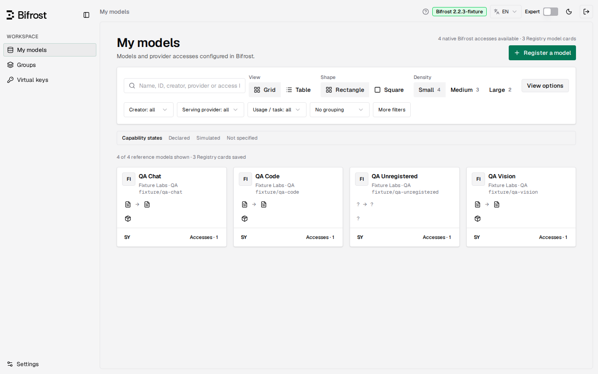
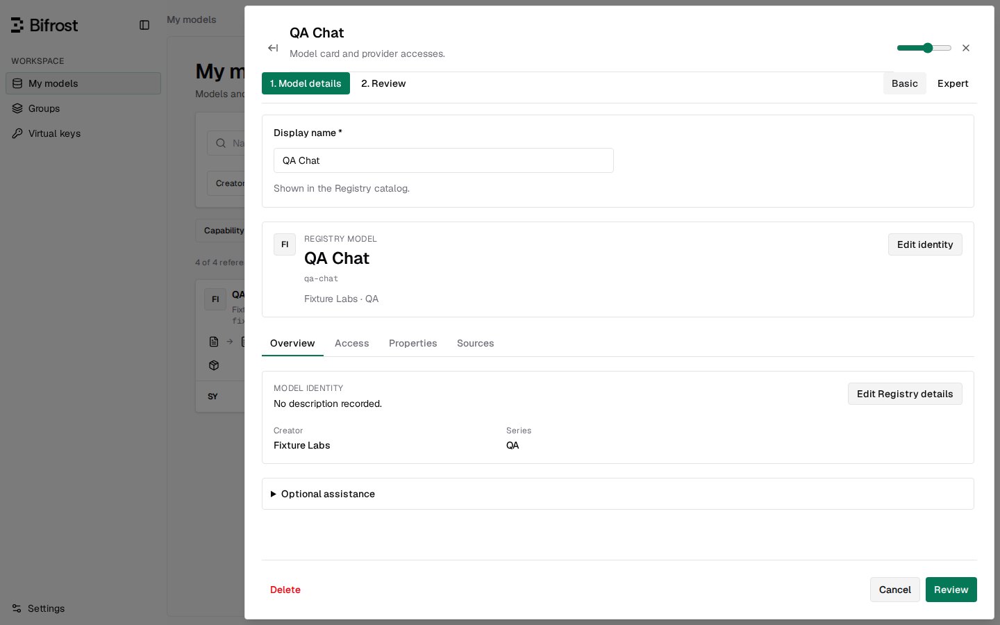
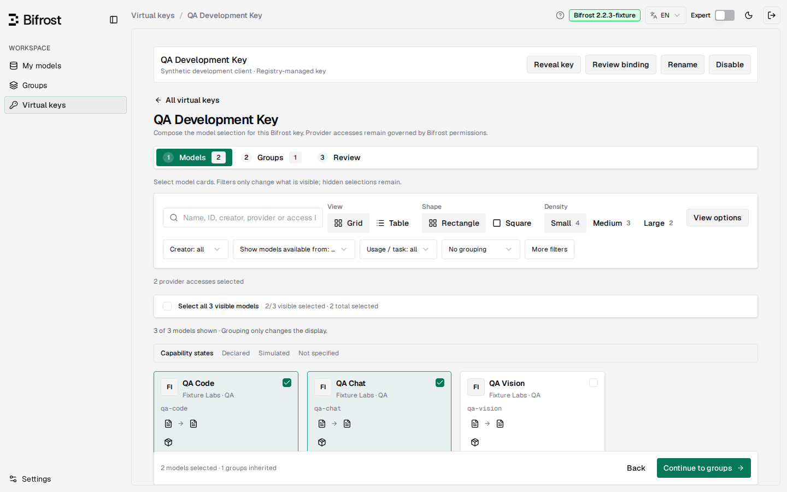
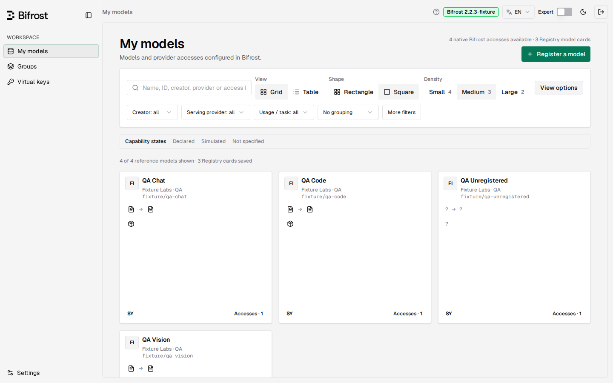

# Using Registry

English · [Français](fr/USER-GUIDE.md)

The interface includes **Settings → Help** and a help button in the header. This guide describes the current interface; [STATUS](https://github.com/sofianbll/bifrost-plugin-registry/blob/main/STATUS.md) records release and qualification boundaries.

## 1. Register a model

Open **My models**, inspect a discovered model and choose its provider accesses. Each access retains its exact provider and native model ID. The common model ID is the name Registry will expose according to the key's naming preference.

Provide a valid common ID, display name, and at least one complete access. Select the exposed operations independently for each access: Chat Completions and Responses are separate choices. Existing selections survive editing; newly discovered accesses start with no operations selected. The editor identifies missing required values before Review. Creator, series, prices and capabilities may remain unknown. Choosing an operation permits that Registry request type; it does not test whether the provider supports it.

The model panel can be expanded while retaining the current draft. Review the summary and save. Saving a documentary reference alone does not grant access to a model.

## 2. Understand source data

**Settings → Sources** shows synchronization dates, failures and catalog counts. Open the catalog data for per-field provenance, corrections, exact reference mappings and manual reference creation.

- **Models.dev** supplies a versioned local reference snapshot generated with its upstream core. Its source commit and date identify the data; the refresh date only records when Registry imported that snapshot. Canonical links, provider-specific values and explicit omissions are preserved, as are local corrections and manual reference mappings.
- **Bifrost** supplies gateway configuration and declared model data. A declared value is a source claim, not an inference test.
- **Unknown** means the information is unavailable; it does not mean unsupported or zero.
- **Custom references** can be created under Catalog data → Reference cards → New reference. Connect the appropriate access explicitly afterward.

The current release embeds this Models.dev snapshot; the previous release does not. Refreshing it does not download a newer upstream version: updating the embedded data requires regenerating the snapshot and compiling a new release. Technical limits (context length, maximum tokens) stay descriptive: Registry does not apply them natively. Generic additional source connectors remain separate work. See [the Models.dev analysis](https://github.com/sofianbll/bifrost-plugin-registry/blob/main/docs/design/models-dev-reuse-research.md).

## 3. Compose groups and keys

Groups are reusable model selections. In a key, a selected model includes all its linked accesses by default. When a selected model has more than one access, the key composer lists them under **Accesses** with a checkbox each: unchecking one excludes that provider access for this key only, without changing the shared group. Basic and Expert share the same draft. Expert is available on wide screens.

For a pre-existing Bifrost key, first **Review adoption**. Registry compares native permissions with registered accesses. If a model must be registered to preserve the key's existing routes, the preview identifies it. Confirm only after reviewing the proposed selection. Adoption cannot widen Bifrost permissions.

Missing accesses are grouped by provider. **Go to models** keeps the current key draft while you register the prerequisites; use the return banner to resume it. Reviewing adoption is also available with unsaved changes. Applying adoption preserves those changes for review and does not publish the pending selection.

Then compose groups, direct additions and local exclusions. Exclusions apply to that key without changing the shared group. Review the resulting IDs, publish and read back `/v1/models`. Readback verifies the listed IDs, not model inference.

## 4. Local snapshot versus connected gateway

The banner identifies the source and capture date. A partial capture can contain unavailable aliases or discovery results.

A snapshot supports local model/catalog editing and local key selection preparation where its adoption plan is valid. It does not modify the original gateway. Its credentials and model listing are simulated, so successful preparation is not proof of live access. Secrets were excluded: revealing a real key, live readback, source refresh and provider calls are unavailable.

The standalone panel uses its own access token and server-side gateway credentials. A compatible native host integration can share Bifrost's authenticated admin surface. This requires the specific compatible host/plugin build; it is not established by opening the snapshot page or installing the current official gateway image.

## 5. Appearance and gateway details

**Settings → Appearance** contains shared display preferences and provider logo overrides. Logos may use an existing icon or an imported PNG, JPEG or WebP. These preferences are saved only in this browser and do not change provider identity or permissions.

Catalogue pages offer Grid and Table views. In Grid, cards can be Rectangle or Square and use Small, Medium or Large density.

The gateway inventory shows captured providers, key permissions, aliases and routing. Tree and detail views show the same data. An alias maps a requested name to a provider target; a deployment can be that provider-specific target. Routing rules select targets using the captured conditions and weights. Missing or encrypted aliases remain explicitly unavailable.
