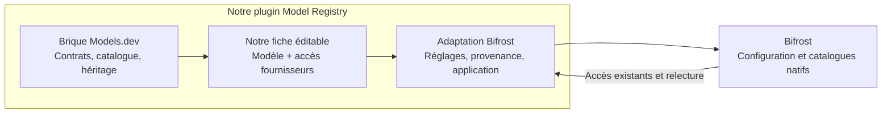

# Réutiliser Models.dev dans Bifrost Registry

**Mise à jour du 27 septembre : l'adaptateur de catalogue local est implémenté dans le candidat de développement, sans release ni qualification native.** Le reste de cette note conserve l'analyse préalable et ses constats historiques sur l'ancien import HTTP. L'application native des limites et prix demeure à réaliser ; le paquet npm n'est pas utilisé à l'exécution.

Le générateur [`build-modelsdev-snapshot.ts`](../../scripts/build-modelsdev-snapshot.ts) appelle le cœur upstream épinglé à [`6a0b12bc9c66e1ab4fe44232d592a32df09a77e0`](https://github.com/anomalyco/models.dev/tree/6a0b12bc9c66e1ab4fe44232d592a32df09a77e0). Le snapshot embarqué conserve 428 références, 223 fournisseurs et 8 185 offres, avec TOML rédigé, résultat résolu, chemins source, commit et date source. Le refresh Registry relit ce snapshot local ; il ne télécharge plus les deux JSON publics. Les valeurs héritées restent sur la référence, les différences rédigées restent sur l'accès, et les omissions de champs connus empêchent leur réapparition par héritage. Les corrections d'accès gardent leur priorité. Seuls les couples fournisseur/modèle configurés exactement reconnus sont enrichis ; aucun rapprochement heuristique d'un fournisseur personnalisé n'est ajouté.

Les propriétés riches sans équivalent Registry restent dans le snapshot source ; leur présence ne signifie pas qu'elles sont éditables ou applicables dans Bifrost. Le moteur Models.dev exécute sa validation, son héritage et sa normalisation lors de la génération avec Bun, pas dans le plugin Go. Le [contrat de reprise et la TODO](model-card-bifrost-contract.md#reprise-modelsdev-et-opérations--27-septembre-2026) distingue cette tranche des travaux produit restants.

Pour régénérer depuis le checkout upstream propre déjà installé et ses dépendances : `bun scripts/build-modelsdev-snapshot.ts internal/admin/data/modelsdev.json.gz`. Vérification reproductible : `bun scripts/build-modelsdev-snapshot.test.ts`. Les tests Go consomment directement le snapshot embarqué ; aucun checkout upstream ni Bun n'est requis pour exécuter le plugin ou ses tests ordinaires.

## Conclusion

Models.dev se réutilise utilement comme **source de données et moteur de génération/validation du catalogue**, derrière un adaptateur Registry. La séparation upstream entre modèle canonique du laboratoire et offre d’un provider correspond bien au besoin « une fiche modèle, plusieurs accès ». Le SDK publié seul ne suffit cependant pas à reconstruire cette relation : le générateur supprime `base_model` après résolution. Le site Models.dev conserve le lien en relisant les TOML sources, via `loadProviderBaseModelRefs`, puis le résout et rattache les entrées provider avec `resolveCanonicalModelId` et `connectProviderEntries` ([source upstream](https://github.com/anomalyco/models.dev/blob/6a0b12bc9c66e1ab4fe44232d592a32df09a77e0/packages/web/src/render.tsx#L149-L178), [liaison](https://github.com/anomalyco/models.dev/blob/6a0b12bc9c66e1ab4fe44232d592a32df09a77e0/packages/web/src/render.tsx#L197-L249), [résolution](https://github.com/anomalyco/models.dev/blob/6a0b12bc9c66e1ab4fe44232d592a32df09a77e0/packages/web/src/render.tsx#L396-L407)). Cette logique existante est le modèle à reprendre ou porter dans l’adaptateur; il ne faut pas réinventer un rapprochement à partir de noms.

La direction recommandée est de figer une version de Models.dev à la génération du catalogue côté projet Registry, en gardant la relation source `base_model` et les overrides du provider dans les données générées. Le plugin Go et son interface React réutiliseraient les mécanismes de références, accès et corrections déjà présents, puis porteraient les nouvelles écritures natives définies dans le [contrat cible](model-card-bifrost-contract.md). Ce branchement n’est pas encore réalisé ni qualifié.

## Ce qui est réutilisable

| Élément | Source et comportement vérifié | Réutilisation dans Registry |
|---|---|---|
| Métadonnées canoniques du modèle | `models/<lab>/<model>.toml`: identifiant dérivé du chemin; description, famille, capacités, dates, modalités, limites, poids, benchmarks et liens. [`schema.ts`](https://github.com/anomalyco/models.dev/blob/6a0b12bc9c66e1ab4fe44232d592a32df09a77e0/packages/core/src/schema.ts#L223-L248), [`generate.ts`](https://github.com/anomalyco/models.dev/blob/6a0b12bc9c66e1ab4fe44232d592a32df09a77e0/packages/core/src/generate.ts#L33-L58) | Source solide pour les faits de référence et leur validation avant adaptation aux champs Registry. |
| Offre d’un provider | `providers/<provider>/models/...toml`: modèle servi, prix, paramètres de raisonnement, statut, overrides de requête. Le modèle résolu porte son ID provider; `provider.toml` décrit le fournisseur public, son SDK, ses variables et sa documentation. [`schema.ts`](https://github.com/anomalyco/models.dev/blob/6a0b12bc9c66e1ab4fe44232d592a32df09a77e0/packages/core/src/schema.ts#L250-L310), [contrat provider](https://github.com/anomalyco/models.dev/blob/6a0b12bc9c66e1ab4fe44232d592a32df09a77e0/packages/core/src/schema.ts#L384-L437) | Alimenter l’enrichissement des accès précis déjà connus par Registry; ne pas traiter le provider public comme une instance d’accès configurée par l’utilisateur. |
| Résolution `base_model` et `base_model_omit` | Référence vers les métadonnées du laboratoire; objets fusionnés en profondeur, valeurs provider prioritaires, tableaux remplacés et chemins omis après fusion. Les champs benchmarks/licence/liens/poids sont exclus de l’héritage provider. Une référence absente échoue. [`generate.ts`](https://github.com/anomalyco/models.dev/blob/6a0b12bc9c66e1ab4fe44232d592a32df09a77e0/packages/core/src/generate.ts#L156-L190) | Réutiliser la sémantique upstream de la relation et des overrides. Garder la référence canonique avant l’aplatissement pour alimenter `ReferenceID`. |
| Identifiants et relation entre niveaux | `generateCatalog()` renvoie `{models, providers}`; les modèles canoniques et les offres provider restent dans deux maps distinctes. Le `id` canonique vient de `lab/model`; l’ID provider vient du chemin sous le provider. [`generate.ts`](https://github.com/anomalyco/models.dev/blob/6a0b12bc9c66e1ab4fe44232d592a32df09a77e0/packages/core/src/generate.ts#L23-L31), [`generate.ts`](https://github.com/anomalyco/models.dev/blob/6a0b12bc9c66e1ab4fe44232d592a32df09a77e0/packages/core/src/generate.ts#L97-L130) | Conserver la clé canonique pour la fiche partagée et la clé provider pour chaque accès; plusieurs accès peuvent pointer vers une même référence. |
| Capacités, prix et paramètres | Schéma strict : modalités texte/audio/image/vidéo/PDF, capacités, limites; coût USD/MTok avec audio/cache/raisonnement et paliers de contexte; options reasoning toggle/effort/budget; statuts alpha/beta/deprecated. Les modèles `reasoning=true` requièrent `reasoning_options`; liste vide acceptée. [`schema.ts`](https://github.com/anomalyco/models.dev/blob/6a0b12bc9c66e1ab4fe44232d592a32df09a77e0/packages/core/src/schema.ts#L25-L112), [`schema.ts`](https://github.com/anomalyco/models.dev/blob/6a0b12bc9c66e1ab4fe44232d592a32df09a77e0/packages/core/src/schema.ts#L150-L174), [`schema.ts`](https://github.com/anomalyco/models.dev/blob/6a0b12bc9c66e1ab4fe44232d592a32df09a77e0/packages/core/src/schema.ts#L250-L380) | Mapper uniquement les champs acceptés par le contrat Registry; conserver les champs plus riches en source/provenance plutôt que les perdre à la conversion. |
| Filtre de type global | Le seul type générique de modèle dans le cœur est `decision`; par défaut les entrées typées sont exclues et `all` les inclut. [`filter.ts`](https://github.com/anomalyco/models.dev/blob/6a0b12bc9c66e1ab4fe44232d592a32df09a77e0/packages/core/src/filter.ts#L1-L83) | Ne pas importer cela comme taxonomie d’usage Registry. Les types `retrieval`/`evaluation` vus dans le synchroniseur Vercel décrivent son API source, pas un vocabulaire global Models.dev ([source Vercel](https://github.com/anomalyco/models.dev/blob/6a0b12bc9c66e1ab4fe44232d592a32df09a77e0/packages/core/src/sync/providers/vercel.ts#L23-L69)). |
| Génération et validation des TOML | Le cœur Bun/Zod lit les modèles, valide les providers et résout leurs héritages. Les tests vérifient équivalence des JSON direct/factorisé, omission et absence de pointeurs dans la sortie. [`generate.test.ts`](https://github.com/anomalyco/models.dev/blob/6a0b12bc9c66e1ab4fe44232d592a32df09a77e0/packages/core/test/generate.test.ts#L48-L140), [`generate.test.ts`](https://github.com/anomalyco/models.dev/blob/6a0b12bc9c66e1ab4fe44232d592a32df09a77e0/packages/core/test/generate.test.ts#L196-L225) | Bon moteur de génération en amont ou pendant la construction de l’artefact catalogue; adapter ensuite vers le modèle Registry. Les tests cités sont des preuves présentes dans le code source, ils n’ont pas été relancés ici. |
| Résumé de description | `describeModel()` déduit une phrase depuis ID, nom, famille, statut et capacités via règles et motifs de texte. [`describe.ts`](https://github.com/anomalyco/models.dev/blob/6a0b12bc9c66e1ab4fe44232d592a32df09a77e0/packages/core/src/describe.ts#L24-L95) | Utilisable comme texte de présentation heuristique explicitement identifié; ce n’est ni une recherche factuelle ni une preuve de capacités. |
| Collecteurs/synchroniseurs | Modules provider-specific; le runner central gère IO TOML, validation, dry-run, création/actualisation/suppression et options de conservation. [`sync/index.ts`](https://github.com/anomalyco/models.dev/blob/6a0b12bc9c66e1ab4fe44232d592a32df09a77e0/packages/core/src/sync/index.ts#L75-L110), [`sync/index.ts`](https://github.com/anomalyco/models.dev/blob/6a0b12bc9c66e1ab4fe44232d592a32df09a77e0/packages/core/src/sync/index.ts#L245-L260), [guide sync](https://github.com/anomalyco/models.dev/blob/6a0b12bc9c66e1ab4fe44232d592a32df09a77e0/sync.md#L35-L52) | Ne pas recréer les collecteurs dans Registry. Ils maintiennent le catalogue upstream; le plugin a besoin d’un instantané/fournisseur de données consommable, pas de tous les workflows d’auteur. |

## L’interface contient déjà une partie de notre parcours

| Fonction réelle | Preuve dans le code | Adaptation dans le plugin |
|---|---|---|
| Navigation Models / Providers / Labs, listes et pages de détail | [Routes et pages](https://github.com/anomalyco/models.dev/blob/6a0b12bc9c66e1ab4fe44232d592a32df09a77e0/packages/web/src/render.tsx#L409-L466) | Reprendre la séparation des concepts et les présentations utiles. Les labs correspondent aux créateurs, pas à nos groupes de sélection. |
| Une page par modèle avec les fournisseurs qui le servent | [ModelPage](https://github.com/anomalyco/models.dev/blob/6a0b12bc9c66e1ab4fe44232d592a32df09a77e0/packages/web/src/render.tsx#L814-L865) et [table provider/modèle](https://github.com/anomalyco/models.dev/blob/6a0b12bc9c66e1ab4fe44232d592a32df09a77e0/packages/web/src/render.tsx#L1101-L1198) | Réutiliser ce regroupement et l’affichage des prix, limites et capacités propres à chaque accès. Ajouter la sélection des accès réellement configurés dans Bifrost. |
| Recherche globale par modèle, provider et lab avec classement et navigation clavier | [Recherche navigateur](https://github.com/anomalyco/models.dev/blob/6a0b12bc9c66e1ab4fe44232d592a32df09a77e0/packages/web/src/index.ts#L94-L311) | Le classement et les interactions peuvent être portés dans nos sélecteurs. Cette recherche ne constitue pas un système complet de filtres de tableau. |
| Tri des colonnes, copie d’identifiants et liens de documentation | [Comportements navigateur](https://github.com/anomalyco/models.dev/blob/6a0b12bc9c66e1ab4fe44232d592a32df09a77e0/packages/web/src/index.ts#L451-L620), [liste providers](https://github.com/anomalyco/models.dev/blob/6a0b12bc9c66e1ab4fe44232d592a32df09a77e0/packages/web/src/render.tsx#L728-L777) | Reprendre les comportements nécessaires et les libellés utiles dans notre UI existante. |
| Logos providers et labs, affichage des modalités et valeurs inconnues | [Présentation partagée](https://github.com/anomalyco/models.dev/blob/6a0b12bc9c66e1ab4fe44232d592a32df09a77e0/packages/web/src/shared.ts#L1-L92), [génération des assets](https://github.com/anomalyco/models.dev/blob/6a0b12bc9c66e1ab4fe44232d592a32df09a77e0/packages/web/script/build.ts#L23-L69) | Réutiliser les assets et les formats lorsque leur sémantique correspond à nos champs. |

À ce commit, le site n’offre pas de formulaire privé d’édition de fiche ou de connexion provider, ni de gestion de clés/VK. L’édition documentée passe par les TOML et les contributions GitHub. Les réglages `provider.toml` sont des **définitions d’intégration** (`api`, `npm`, noms des variables d’authentification), et les champs `model.provider` peuvent préciser la forme API, des en-têtes et des champs de requête ; ce ne sont pas les secrets ni les instances Bifrost de l’utilisateur. Les filtres à facettes, choix de colonnes et workflow de comparaison ne sont pas présents dans le code navigateur inspecté. [Contribution](https://github.com/anomalyco/models.dev/blob/6a0b12bc9c66e1ab4fe44232d592a32df09a77e0/README.md#adding-a-new-provider-model), [contrats](https://github.com/anomalyco/models.dev/blob/6a0b12bc9c66e1ab4fe44232d592a32df09a77e0/packages/core/src/schema.ts#L300-L310), [client complet](https://github.com/anomalyco/models.dev/blob/6a0b12bc9c66e1ab4fe44232d592a32df09a77e0/packages/web/src/index.ts).

Le site produit du HTML statique avec Hono JSX et Bun ; notre UI est React/Vite. On peut adapter ses écrans et fonctions, mais les importer comme composants React demanderait un portage. Servir le site généré comme catalogue séparé demanderait de traiter ses chemins absolus et son routage, puis d’ajouter le parcours d’édition Registry. Pour une seule interface cohérente, reprendre les morceaux utiles dans l’UI du plugin paraît plus simple. [Paquet web](https://github.com/anomalyco/models.dev/blob/6a0b12bc9c66e1ab4fe44232d592a32df09a77e0/packages/web/package.json), [build statique](https://github.com/anomalyco/models.dev/blob/6a0b12bc9c66e1ab4fe44232d592a32df09a77e0/packages/web/script/build.ts#L71-L94), [UI Registry](../../ui/package.json).

## Sources upstream, paquet SDK et plugin

| Couche | Ce qu’elle fournit | Limite pour le besoin Registry |
|---|---|---|
| Dépôt source Models.dev | TOML séparant métadonnées lab et entrée provider; core `generateCatalog()` produit les deux vues résolues et Zod valide strictement les formes. | `@models.dev/core` est `private`, son entrée pointe vers le TypeScript source, et il dépend de Zod/Remeda; le générateur utilise Bun/TOML. Ce n’est pas une dépendance npm runtime prête à brancher dans le plugin Go. [package core](https://github.com/anomalyco/models.dev/blob/6a0b12bc9c66e1ab4fe44232d592a32df09a77e0/packages/core/package.json#L1-L17), [génération SDK](https://github.com/anomalyco/models.dev/blob/6a0b12bc9c66e1ab4fe44232d592a32df09a77e0/packages/sdk/script/generate.ts#L1-L29) |
| SDK publié `@opencode-ai/models` | Client TS/JS pour GET `/api.json`, `/models.json`, `/catalog.json`; snapshot JSON embarqué; Fetch injectable, timeout via AbortSignal, types et module Effect optionnel. [`README`](https://github.com/anomalyco/models.dev/blob/6a0b12bc9c66e1ab4fe44232d592a32df09a77e0/packages/sdk/README.md#L1-L74), [client](https://github.com/anomalyco/models.dev/blob/6a0b12bc9c66e1ab4fe44232d592a32df09a77e0/packages/sdk/src/client.ts#L24-L89), [distribution](https://github.com/anomalyco/models.dev/blob/6a0b12bc9c66e1ab4fe44232d592a32df09a77e0/packages/sdk/package.json#L25-L67) | Client sans cache; le parse fait `JSON.parse(...) as A`, sans validation Zod d’exécution. Les types sont des déclarations manuelles testées en cohérence avec core. Snapshot/API ne gardent pas la référence `base_model` après génération. [`client.ts`](https://github.com/anomalyco/models.dev/blob/6a0b12bc9c66e1ab4fe44232d592a32df09a77e0/packages/sdk/src/client.ts#L68-L89), [`types.ts`](https://github.com/anomalyco/models.dev/blob/6a0b12bc9c66e1ab4fe44232d592a32df09a77e0/packages/sdk/src/types.ts#L141-L177), [test de génération](https://github.com/anomalyco/models.dev/blob/6a0b12bc9c66e1ab4fe44232d592a32df09a77e0/packages/core/test/generate.test.ts#L99-L108) |
| Site Models.dev | Génère l’interface publique au-dessus de `generateCatalog()`; relit les TOML originaux pour `base_model`, puis relie les provider entries aux fiches canoniques. [`render.tsx`](https://github.com/anomalyco/models.dev/blob/6a0b12bc9c66e1ab4fe44232d592a32df09a77e0/packages/web/src/render.tsx#L24-L36), [référence TOML](https://github.com/anomalyco/models.dev/blob/6a0b12bc9c66e1ab4fe44232d592a32df09a77e0/packages/web/src/render.tsx#L149-L178) | L’interface est Hono JSX rendue serveur, Bun et HTML statique; pas de composants React, édition locale ni administration Bifrost prêts à intégrer. L’audit UI détaillé est conservé dans `dist/models-dev-ui-audit.md` (ignoré par Git). |
| Plugin Bifrost Registry | Contrôle Go, modèle React, références, accès, provenance par champ et overrides existent déjà. Le modèle interne garde références distinctes des accès et leurs `referenceId`. [catalogue Go](../../internal/registry/catalog.go#L12-L65), [résolution de valeurs](../../internal/registry/catalog.go#L199-L213), [UI modèle](../../ui/src/ModelBrowser.tsx#L18-L40) | Cette recherche n’établit aucune intégration Models.dev terminée dans le plugin. L’adaptateur doit rester dans Registry et respecter ses identités d’accès/configuration Bifrost. |

Le SDK publie automatiquement après validation et tests lors d’un workflow quotidien configuré `--if-changed`; c’est une cadence de publication configurée, pas un engagement SLA de fraîcheur. [workflow de publication](https://github.com/anomalyco/models.dev/blob/6a0b12bc9c66e1ab4fe44232d592a32df09a77e0/.github/workflows/publish-sdk.yml#L11-L57). Le dépôt contient aussi un workflow OpenCode déclenché par les issues pour proposer des changements TOML minimaux et ouvrir une PR; c’est un mécanisme de maintenance du catalogue, pas un éditeur enrichi intégrable dans le plugin. [workflow issue-fixer](https://github.com/anomalyco/models.dev/blob/6a0b12bc9c66e1ab4fe44232d592a32df09a77e0/.github/workflows/issue-fixer.yml#L1-L20), [règles et portée](https://github.com/anomalyco/models.dev/blob/6a0b12bc9c66e1ab4fe44232d592a32df09a77e0/.github/workflows/issue-fixer.yml#L54-L79).

## Conséquence directe pour le catalogue Registry existant

Le rafraîchissement Registry lit actuellement `/models.json` et `/api.json` avec `?type=all`, mappe un sous-ensemble de champs, puis enrichit uniquement les accès déjà configurés dont le couple provider/modèle existe ([`catalog.go`](../../internal/admin/catalog.go#L539-L638)). Il tente de lire `row.base_model` pour relier un accès à une référence (`catalog.go#L603-L624`). Or le cœur upstream retire `base_model` et `base_model_omit` de chaque objet provider avant de produire le JSON résolu; ses tests l’assertent explicitement ([générateur](https://github.com/anomalyco/models.dev/blob/6a0b12bc9c66e1ab4fe44232d592a32df09a77e0/packages/core/src/generate.ts#L108-L130), [fusion](https://github.com/anomalyco/models.dev/blob/6a0b12bc9c66e1ab4fe44232d592a32df09a77e0/packages/core/src/generate.ts#L156-L174), [test](https://github.com/anomalyco/models.dev/blob/6a0b12bc9c66e1ab4fe44232d592a32df09a77e0/packages/core/test/generate.test.ts#L196-L211)). Le test Registry actuel fournit pourtant un faux `api.json` où `base_model` est présent ([fixture](../../internal/admin/catalog_test.go#L65-L73)); cela vérifie le cas du champ, pas son existence dans la sortie Models.dev générée à ce commit.

Le repli actuel vers une référence dont l’ID égale l’ID de l’accès est conservé dans [`catalog.go`](../../internal/admin/catalog.go#L617-L624). Il peut traiter certains identifiants identiques, mais ne remplace pas la relation canonique explicite quand l’ID provider diffère. L’interface publique Models.dev résout déjà ce cas à partir des TOML source, pas depuis les JSON aplatis. L’étape d’intégration devra donc injecter les pointeurs source ou un mapping équivalent dans le catalogue Registry versionné, puis laisser les correspondances manuelles et overrides Registry faire autorité quand ils existent.

Il y a aussi un enjeu de provenance des champs : le rafraîchissement copie les champs du modèle provider résolu vers les candidats de l’accès ([`catalog.go`](../../internal/admin/catalog.go#L625-L635)), puis `catalogFieldsForAccess` compose d’abord les champs effectifs de la référence et applique ceux de l’accès ensuite ([`catalog.go`](../../internal/admin/catalog.go#L20-L46)). Comme Models.dev a déjà hérité dans ce JSON des valeurs canoniques non remplacées, un candidat d’accès peut donc masquer une correction de la fiche commune, même si le champ n’était pas un vrai delta du provider. C’est une conséquence du flux de données décrit, pas un défaut runtime reproduit ni une décision de priorité approuvée. Elle motive la conservation du `base_model` et des overrides/deltas authored-vs-inherited; éviter d’importer la copie aplatie entière comme s’il s’agissait de champs rédigés spécifiquement pour l’accès.

Le catalogue Registry représente déjà les candidats par source et donne priorité aux overrides utilisateur dans `EffectiveCatalogFields()` ([`catalog.go`](../../internal/registry/catalog.go#L26-L46), [`catalog.go`](../../internal/registry/catalog.go#L199-L213)). L’importer ne doit donc pas remplacer ce mécanisme par une copie brute ou une fusion destructive. Le endpoint `model-schema.json` est exposé par le Worker, mais son JSON Schema ne valide que le type string et énumère les IDs `provider/model`; il ne décrit pas les champs, capacités, prix ou limites ([Worker](https://github.com/anomalyco/models.dev/blob/6a0b12bc9c66e1ab4fe44232d592a32df09a77e0/packages/function/src/worker.ts#L76-L108), [tests du Worker](https://github.com/anomalyco/models.dev/blob/6a0b12bc9c66e1ab4fe44232d592a32df09a77e0/packages/function/test/worker.test.ts#L60-L75)). Le client SDK expose les trois vues du catalogue, mais pas de validation Zod runtime; le schéma Zod est le contrat du code source ([endpoints SDK](https://github.com/anomalyco/models.dev/blob/6a0b12bc9c66e1ab4fe44232d592a32df09a77e0/packages/sdk/src/client.ts#L82-L89), [exports core](https://github.com/anomalyco/models.dev/blob/6a0b12bc9c66e1ab4fe44232d592a32df09a77e0/packages/core/src/index.ts#L1-L5)).

## Proposition d’intégration, sans modification fonctionnelle

1. **Épingler la donnée source.** Générer une version datée du catalogue depuis un commit Models.dev déterminé. Inclure les deux vues (`models`, `providers`), une table de références provider/model → modèle canonique lue avant fusion, comme le fait déjà le site, et les champs réellement rédigés/omis côté provider. Stocker le commit upstream et la date de génération comme provenance de source. Les modèles sans `base_model` restent à traiter explicitement ; le catalogue n’apporte pas une preuve d’exhaustivité mondiale. Ne pas dépendre d’un refresh web sans cache pour le fonctionnement normal du plugin.
2. **Adapter à la frontière Registry.** Convertir métadonnées canoniques en références et offres provider en enrichissement d’accès, sans confondre fournisseur public avec accès utilisateur ni disponibilité théorique avec accès configuré. Mapper les champs connus dans `catalogFields`; garder le reste dans les données source/extension si nécessaire. Appliquer les mêmes règles de validation et limites que les autres sources Registry.
3. **Garder l’autorité locale.** Continuer à préserver les deux candidats `models.dev`/`bifrost`, les corrections manuelles et le mapping explicite. Le pointeur upstream propose un lien de référence par défaut; il ne doit pas écraser un mapping manuel ni fusionner automatiquement deux IDs proches sans identité source.
4. **Réutiliser le code adapté à chaque couche.** Core et la lecture des références sources servent à produire le catalogue ; SDK/snapshot peuvent fournir les types ou une consommation JSON lorsque cela suffit. Le SDK seul ne remplace pas le moteur d’héritage et de validation. Reprendre le raccordement canonique de `render.tsx` et les fonctions/écrans utiles dans notre UI. Les collecteurs upstream peuvent maintenir la référence sans tourner dans chaque gateway. La [licence MIT du dépôt](https://github.com/anomalyco/models.dev/blob/6a0b12bc9c66e1ab4fe44232d592a32df09a77e0/LICENSE) comporte un avis à conserver avec les portions de code réutilisées.
5. **Appliquer via Registry.** L’éditeur du plugin conserve les portées modèle/accès et prépare les modifications natives : catalogue de paramètres/pricing pour les propriétés correspondantes, API de configuration Bifrost pour les réglages opérationnels. Les alias, autorisations, groupes et VK relèvent de cette couche Registry/Bifrost. L’état « appliqué » doit venir d’une relecture native. Le [contrat Bifrost étudié](model-card-bifrost-contract.md#4-écriture-native--ce-qui-est-établi) décrit les destinations possibles ; le processus complet reste à qualifier. Un attribut clé/valeur homonyme ne remplace pas l’écriture du véritable champ technique.

### Prochaine tranche verticale utile

Valider un modèle canonique Claude Sonnet 4.6 avec deux offres provider configurées : comparer référence canonique, noms/limites/modalités, prix distincts par accès, correspondance `base_model`, persistance source/override et lecture UI. Utiliser le même fixture à travers génération de données et rafraîchissement Registry. Cette proposition n’a pas été implémentée ni testée dans cette recherche.

## Sources locales

- [Audit détaillé du cœur Models.dev (snapshot local)](../../dist/models-dev-core-audit.md) — génération, validation, héritage et champs.
- [Audit UI/source Models.dev](../../dist/models-dev-ui-audit.md) — comparatif d’interface; fichier local ignoré par Git.
- [État Registry](../../STATUS.md) — périmètre et limites de qualification du plugin/gateway.
- [Contrat modèle et Bifrost](model-card-bifrost-contract.md) — correspondance au modèle natif.
