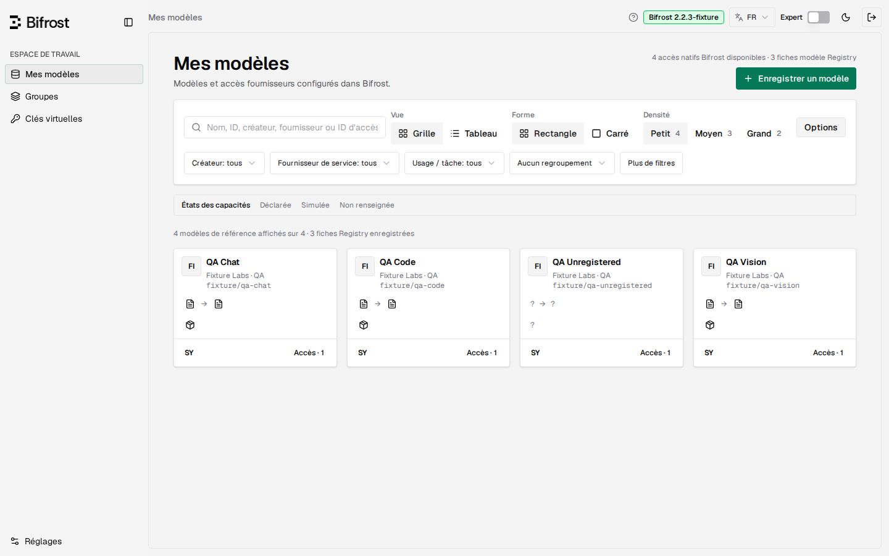

# Documentation de Bifrost Registry

[English](../) · Français

Registry ajoute un catalogue de modèles fiable et une composition d'accès par clé aux clés virtuelles Bifrost. Il tourne comme plugin à côté d'un gateway Bifrost non modifié et sert sa propre interface. C'est un projet indépendant, pas un produit officiel Maxim/Bifrost.

## Utiliser Registry

| Guide | Contenu |
| --- | --- |
| [Installation](INSTALL.md) | Quels fichiers pour quel hôte, les deux modes d'installation, identifiants, mise à jour et retour arrière |
| [Dépannage](TROUBLESHOOTING.md) | Erreurs de permission sur le répertoire temporaire, `Dynamic loading not supported`, échecs d'activation |
| [Guide utilisateur](USER-GUIDE.md) | Enregistrement de modèles, sources, groupes, clés et limites de l'instantané local |
| [Configuration](CONFIGURATION.md) | Fiches Registry, groupes, politiques de clé, API du panneau et anciennes datasheets |
| [Sécurité et frontière de confiance](SECURITY.md) | Gouvernance native, accès admin et contraintes d'exploitation |

Pour la release courante, ses preuves et ses limites, lire [STATUS](https://github.com/sofianbll/bifrost-plugin-registry/blob/main/STATUS.md) (en anglais). Pour signaler une vulnérabilité, suivre la [politique de sécurité](https://github.com/sofianbll/bifrost-plugin-registry/blob/main/SECURITY.md) (en anglais).

## Développer et valider

- [Guide de contribution](https://github.com/sofianbll/bifrost-plugin-registry/blob/main/CONTRIBUTING.md) : prérequis, contrôles sources et pull requests.
- [UI React](https://github.com/sofianbll/bifrost-plugin-registry/blob/main/ui/README.md) : développement du frontend et provenance upstream.
- [Compilation native](../BUILD.md) : compiler le gateway et le plugin avec des dépendances compatibles.
- [Paquetage](https://github.com/sofianbll/bifrost-plugin-registry/blob/main/packaging/README.md) : empaqueter une paire vérifiée en artefacts séparés.
- [Acceptation du déploiement](../ACCEPTANCE.md) : contrôles pour un environnement cible.
- [Preuves de release](https://github.com/sofianbll/bifrost-plugin-registry/blob/main/reports/README.md) et [changelog](https://github.com/sofianbll/bifrost-plugin-registry/blob/main/CHANGELOG.md).

## Conception et historique

Le [vocabulaire du domaine](https://github.com/sofianbll/bifrost-plugin-registry/blob/main/CONTEXT.md), la [spécification de la release V1](https://github.com/sofianbll/bifrost-plugin-registry/blob/main/docs/design/core-v1-spec.md) et les [décisions produit actuelles](https://github.com/sofianbll/bifrost-plugin-registry/blob/main/docs/design/product-direction.md) cadrent le projet. Les revues datées, l'archive et les rapports témoignent de jalons passés, pas d'instructions d'installation actuelles ; ils restent sur GitHub et ne sont pas publiés ici.
